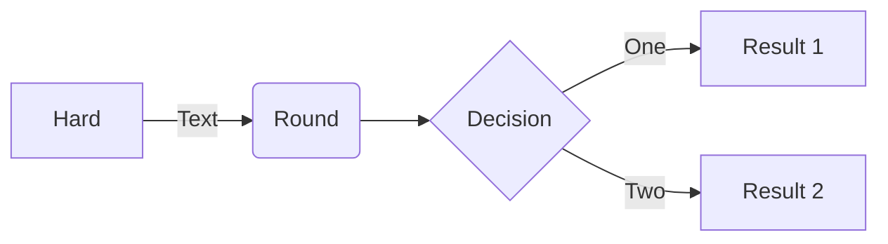

# Markdown

To use the Markdown you need to set the snippet language in **"Markdown"**. To do this, click on the language selector located at the bottom left of the editor panel, and choose **"Markdown"** from the drop-down list.

## Preview Markdown

Follow one of the following steps:
- Select **"Editor"** > **"Preview Markdown"** from the menu bar.
- Click **"<svg xmlns="http://www.w3.org/2000/svg" width="16" height="16" viewBox="0 0 24 24" fill="none" stroke="currentColor" stroke-width="2" stroke-linecap="round" stroke-linejoin="round" class="feather feather-eye"><path d="M1 12s4-8 11-8 11 8 11 8-4 8-11 8-11-8-11-8z"></path><circle cx="12" cy="12" r="3"></circle></svg>"** button on the top right corner of the editor

## Mermaid Diagrams

massCode v2.7 and above supports Mermaid, which is a way to create various diagrams and visualizations with code.

> To learn more about the syntax, please refer to [Mermaid documentations](https://mermaid-js.github.io/mermaid/#/?id=diagram-types).


### Use

````markdown

````

</img>


